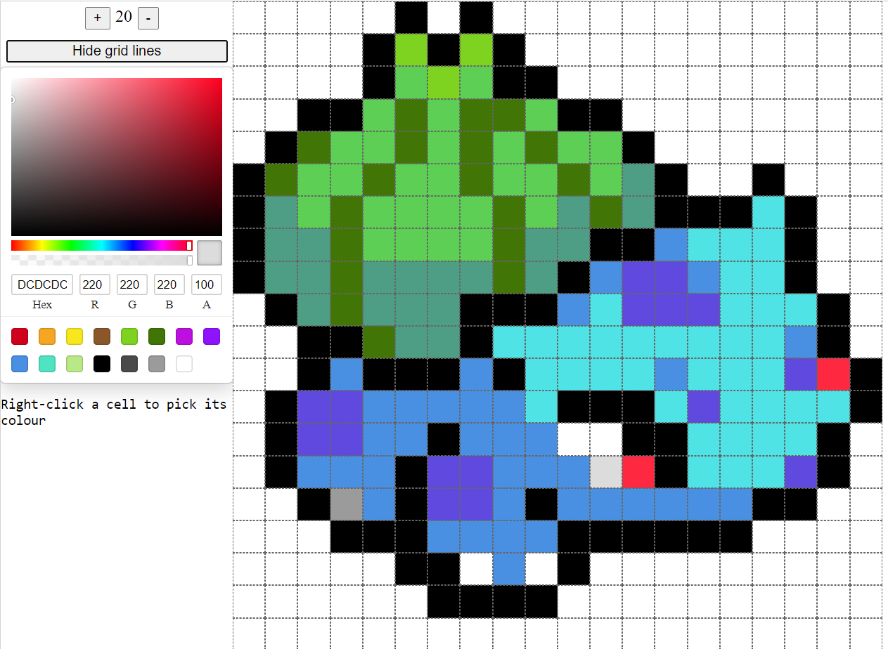

# Pixel art (ReScript + React)

This repo is one of several in which I've written the same app using different languages. See [frontends-comparison](https://github.com/hwallis93/frontends-comparison) for more info.

This version of the app is based off [ReScript](https://rescript-lang.org/) and Create React App.

It looks like this:

# ReScript thoughts
- Functional aspects and solid typing make it very pleasant and safe to write
- JS interop is great, really easy to add a 3rd party React component
- Compiler is really fast and its output is legible
  - This is especially helpful when trying to get JS interop (`external`) calls just right
- Docs are solid
- Dom interaction isn't great yet
- Some weirdnesses in the language that show it's still growing (e.g. `Js.Array` vs `Js.Array2`)

# TOdo
- KEys for maps of elements
